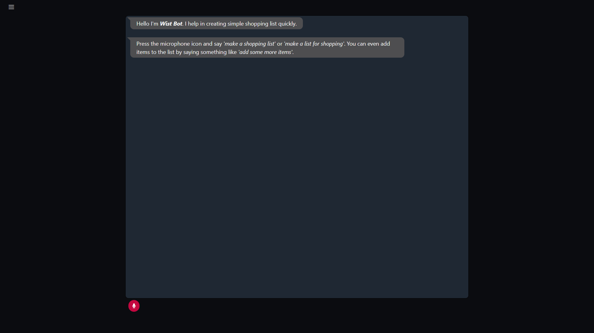

 

  <h3 align="center">Wist Bot</h3>
  

    An NLP based chat bot to create a list for shopping!
     
     
## About The Project

[

WIst bot can be used to create shopping list on the go using voice to text feature. It uses NLP to recognize the converted text and go forward with the response.
Why you should use this:
* It saves your time drastically, you can create a list on the go.
* It is handsfree so you can create a list while you are driving to the store.
* It uses NLP so the recognition and response is accurate.

The project is a prototype of what I want to achieve. If you wish like contributing please contact me on any of the links mentioned below with your ideas.

### Built With

* [Bootstrap](https://getbootstrap.com)
* [Wit AI](https://wit.ai/)

<!-- CONTACT -->
## Contact

Niraj Nair - [@NairNiraj](https://twitter.com/NairNiraj) - nirajnknair@gmail.com

Project Link: [Wist Bot](https://github.com/NirajNair/Wist-Bot)
